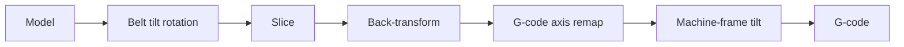

# Machine Frame Transforms

> [!IMPORTANT]
> NEW FEATURE: **Belt printer support**  
> Available in: [Nightly builds](https://github.com/OrcaSlicer/OrcaSlicer/releases/tag/nightly-builds) with the `_belt` suffix (built from the `belt-printer` branch) or Releases greater than **2.4.2**.

These settings convert OrcaSlicer's coordinates into machine coordinates for a belt printer. They are found in **Printer settings → Basic information → Machine frame transforms** and are shown when [belt printing](printer_basic_information_belt_printer#enable-belt-printing) is enabled. The remap rows are only shown in **Developer** mode.

The transforms are applied in this order:

1. The [G-code axis remap](#g-code-axis-remap) determines which slicer axis maps to each machine axis.
2. The [machine-frame tilt](#machine-frame-tilt) compensates for the gantry not being perpendicular to the belt.

These settings are configured in the printer profile to match the machine's kinematics. The [Belt Printing](belt_printing) guide explains their role in the slicing process.

> [!CAUTION]
> Incorrect values can send the toolhead to an unintended position, potentially beyond the machine's travel limits. Check the result with **Show raw G-code (belt only)** in the preview's view menu (see [Preview](belt_printing#preview)), and monitor the first print at the printer.

- [How axis remapping works](#how-axis-remapping-works)
    - [Remap values](#remap-values)
    - [Example: the belt profiles](#example-the-belt-profiles)
    - [Where the remap is applied](#where-the-remap-is-applied)
    - [What to watch for](#what-to-watch-for)
- [G-code axis remap](#g-code-axis-remap)
- [Machine-frame tilt](#machine-frame-tilt)
    - [Decouple machine-frame tilt](#decouple-machine-frame-tilt)
    - [Machine-frame tilt angle](#machine-frame-tilt-angle)

## How axis remapping works

An axis remap has three fields, **X**, **Y** and **Z**, one for each output axis. Each field selects an input axis and defines how its coordinate is mapped to the output. Together, the three fields swap, flip and mirror axes without changing distances.

### Remap values

| Value | Result for a coordinate `v` on the selected input axis |
| --- | --- |
| **+X**, **+Y**, **+Z** | `v`: the coordinate is copied. |
| **-X**, **-Y**, **-Z** | `-v`: the coordinate is negated, so the axis is flipped about the origin. |
| **Rev X**, **Rev Y**, **Rev Z** | `max - v`: the axis is mirrored inside the build volume, so 0 becomes `max` and `max` becomes 0. |

For the Rev values, `max` is the maximum coordinate of the selected input axis: the largest X or Y coordinate in the [printable area](printer_basic_information_printable_space#printable-area-bed-shape), or the [printable height](printer_basic_information_printable_space#printable-height) for Z.

Leaving the three fields at **+X**, **+Y**, **+Z** preserves the original coordinates.

### Example: the belt profiles

The belt profiles included with OrcaSlicer use this [G-code axis remap](#g-code-axis-remap):

| Field | Value | Meaning |
| --- | --- | --- |
| **X** | Rev X | Machine X runs across the belt, mirrored: `X = width - x`. |
| **Y** | +Z | Machine Y, the gantry axis, receives the height above the belt. |
| **Z** | +Y | Machine Z, the belt axis, receives the position along the belt. |

A point placed in Prepare at `x = 20`, `y = 100`, `z = 5` on a belt 350 mm wide is therefore remapped to `X = 330`, `Y = 5`, `Z = 100`. The [machine-frame tilt](#machine-frame-tilt) is then applied to those coordinates.

### Where the remap is applied

The remap acts on the toolpaths after slicing, so it only changes the axis letters and coordinate values used to write each move. The model itself is only rotated by the [belt tilt](printer_basic_information_belt_printer#belt-tilt) before slicing, and that rotation is undone before the remap, so the remap receives points in the coordinate system of the model as placed in Prepare.

### What to watch for

- **Use every input axis exactly once.** OrcaSlicer does not check this. Assigning the same input axis to two outputs, for example **+X** in both the X and Y fields, discards one axis and flattens the print.
- **Custom G-code is not remapped.** Start, end, layer change and other [machine G-code](printer_machine_gcode) is written to the file unchanged, so it must already be in machine coordinates.
- **Every move is written with X, Y and Z** while a remap is active, because any slicer axis can map to any machine axis.
- **Arc moves are limited.** G2/G3 arcs are only written when X and Y are left at **+X** and **+Y**. [Arc fitting](quality_settings_precision#arc-fitting) is disabled on belt printers.
- **The remap is stored in the printer profile.** The fields are hidden when belt printing is disabled, but any configured remap remains active.

## G-code axis remap

[Variables](built_in_placeholders_variables): `gcode_remap_x`, `gcode_remap_y`, `gcode_remap_z`.  
[Type](option_type#choice): `Choice`.  
[Options](option_type#choice): `pos_x, pos_y, pos_z, neg_x, neg_y, neg_z, rev_x, rev_y, rev_z`.  
[CLI Example](cli_mode#setting-overrides): `--gcode-remap-x=pos_x` (same pattern for the other variables above).  
Selects which slicer axis maps to each machine axis in the exported G-code. The remap is applied during G-code generation, after slicing, and does not change the toolpaths.

The **G-code remap X**, **Y** and **Z** rows are the machine axes. The values are described in [How axis remapping works](#how-axis-remapping-works).

These fields are only shown when the settings [mode](option_mode) is **Developer**.

> [!NOTE]
> The subsequent [machine-frame tilt](#machine-frame-tilt) expects the axis mapping used by the belt profiles: height above the belt on the gantry axis and position along the belt on machine Z.

## Machine-frame tilt

[Mode](option_mode): `Expert`.  
[Variables](built_in_placeholders_variables): `belt_frame_tilt_decouple`, `belt_frame_tilt_angle`.  
[Type](option_type): `belt_frame_tilt_decouple` (Boolean), `belt_frame_tilt_angle` (Float).  
[CLI Example](cli_mode#setting-overrides): `--belt-frame-tilt-decouple=1` (`belt_frame_tilt_decouple` shown; other variables above follow their own type).  
On a belt printer, the gantry is not perpendicular to the belt. One millimeter of gantry travel therefore raises the nozzle by less than one millimeter and also moves it along the belt. The machine-frame tilt compensates for both effects so that the printed part matches the model.

For a point at height `h` above the belt and position `y` along it, with a gantry tilted at angle `α`:

- The gantry must travel `h / sin α` to reach that height.
- The layer through the point meets the belt at a distance of `h · cot α` farther along, so the belt position is `y + h · cot α`.

With the [belt profile remap](#example-the-belt-profiles) and a [belt tilt](printer_basic_information_belt_printer#belt-tilt) about X, the remapped coordinates are converted to machine coordinates as follows:

$$
\begin{bmatrix} X_{machine} \\ Y_{machine} \\ Z_{machine} \end{bmatrix} =
\begin{bmatrix} X \\ \dfrac{Y}{\sin\alpha} \\ Z + Y\cot\alpha \end{bmatrix}
$$

For a belt tilt about Y, the same correction is applied to X instead of Y: X is divided by `sin α` and Z becomes `Z - X · cot α`.

For a tilt about X at 45°, this simplifies to `Y · 1.414` for the gantry and `Z + Y` for the belt. At 90°, the gantry is perpendicular to the belt and the coordinates remain unchanged.

By default, the angle is the [belt tilt angle](printer_basic_information_belt_printer#tilt-angle), so one value controls both the slicing rotation and this correction. No correction is applied when the [tilt axis](printer_basic_information_belt_printer#tilt-axis) is **Z** or **None**.

### Decouple machine-frame tilt

Allows the machine-frame correction to use a separate angle from the belt tilt angle.

Enable this option only when the gantry's physical tilt differs from the slicing angle, for example to slice at 30° on a 45° machine.

> [!WARNING]
> Slicing at an angle different from the gantry's tilt changes how close the nozzle and hotend come to previously printed layers. Check the clearance before printing.

### Machine-frame tilt angle

The angle, in degrees, used for the machine-frame correction while [Decouple machine-frame tilt](#decouple-machine-frame-tilt) is enabled. It is ignored otherwise.
